# 🚀 Multi-Cloud GitOps Pipeline: From Infrastructure to Deployment

**A comprehensive DevSecOps project automating infrastructure, configuration, and continuous delivery.**
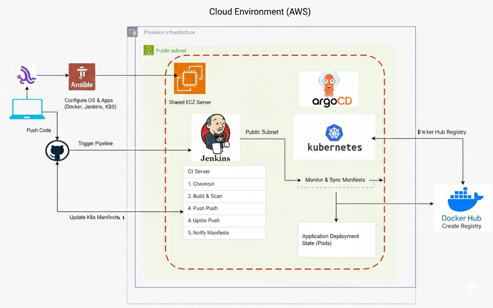
---

## 🏗 Project Architecture Overview
This project demonstrates a professional **GitOps Workflow**. It automates the entire lifecycle of an application, starting from infrastructure provisioning on AWS to continuous deployment on Kubernetes.

---

## 🛠 Phase 1: Infrastructure as Code (Terraform)
We used **Terraform** to ensure our infrastructure is versioned and reproducible.
* **Modular Infrastructure:** Separated VPC, Subnets, and EC2 configurations.
* **Remote Backend:** Configured **S3** for state files and **DynamoDB** for state locking.
* **Resources Created:**
    * Jenkins Master Server.
    * Kubernetes Cluster Nodes.
    * Secure Network (VPC/Subnets).

> **## 📸 Screenshots:**
> 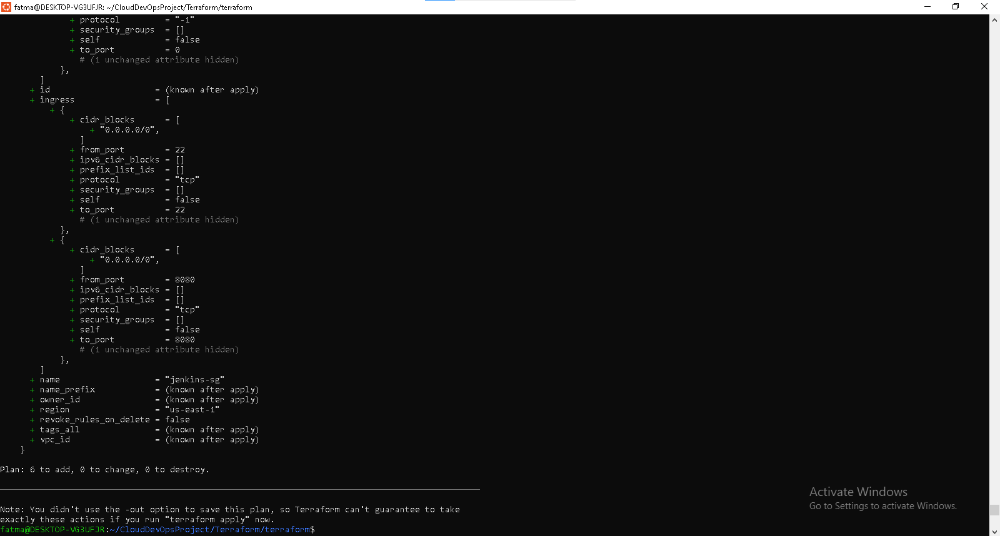
> 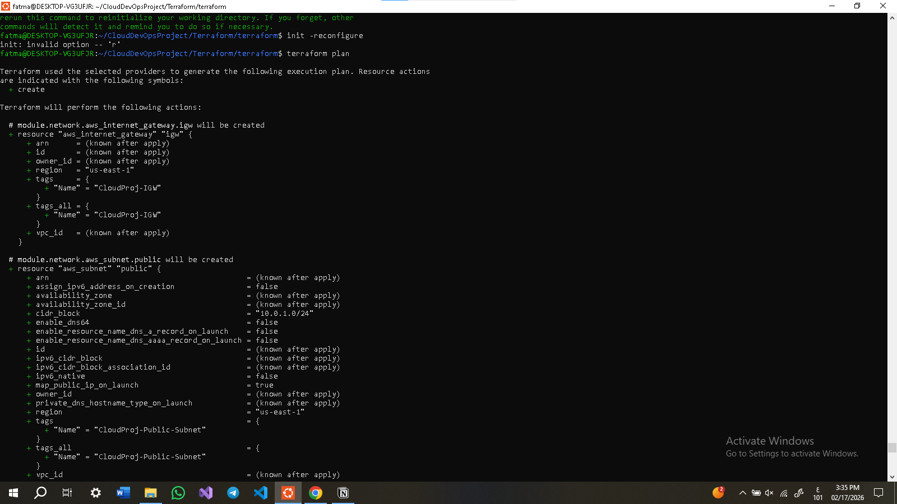

> 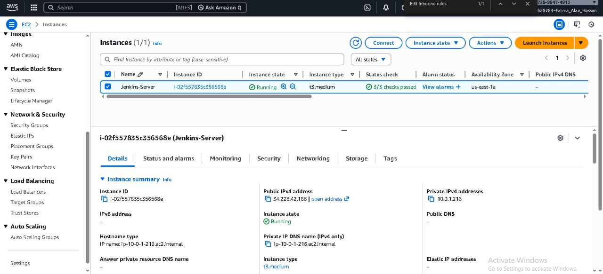
> 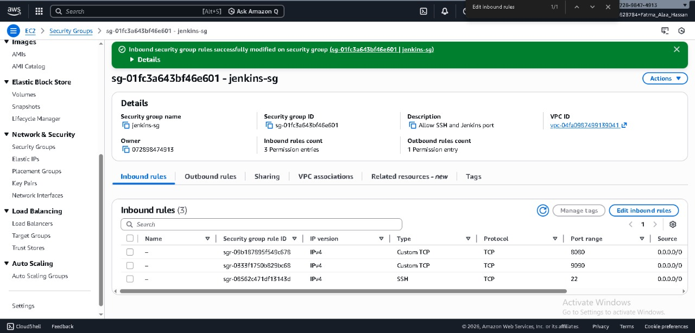

---

## ⚙️ Phase 2: Configuration Management (Ansible)
Once the servers were provisioned, **Ansible Roles** were used to automate the software installation without manual intervention.
* **Roles Included:**
    * **Docker:** To run the containerized Flask app.
    * **Jenkins:** To host the CI pipeline.
    * **Kubeadm:** To bootstrap the Kubernetes cluster.
    * **ArgoCD:** To manage the GitOps synchronization.

> **## 📸 Screenshots:**
> 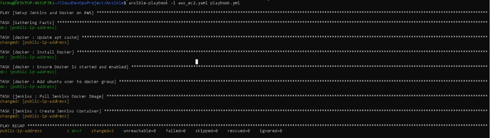

> 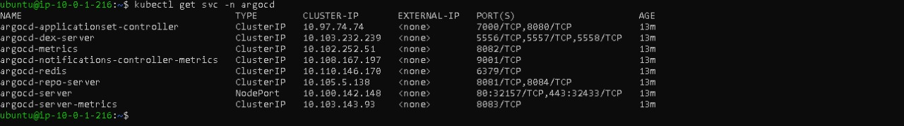

---

## 🔄 Phase 3: CI Pipeline (Jenkins Shared Library)
The CI pipeline is the heart of the project. We used a **Jenkins Shared Library** for modular and reusable code.

### **Pipeline Stages:**
1. **Source Checkout:** Pulls code from GitHub.
2. **Build Image:** Packages the Flask app into a Docker image.
3. **Security Scan:** Scans the Docker image for vulnerabilities.
4. **Push to Docker Hub:** Tags and pushes images (Latest & Build ID).
5. **Manifest Update:** Automatically updates `deployment.yaml` with the new image tag.

> **## 📸 Screenshots:**
> 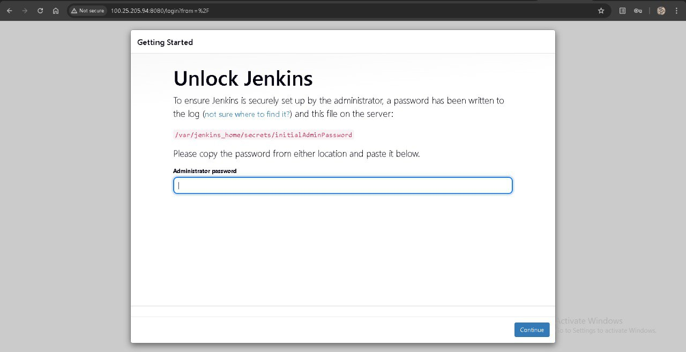
 > 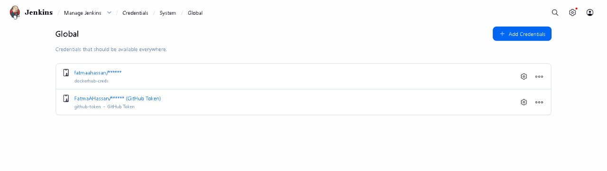
> 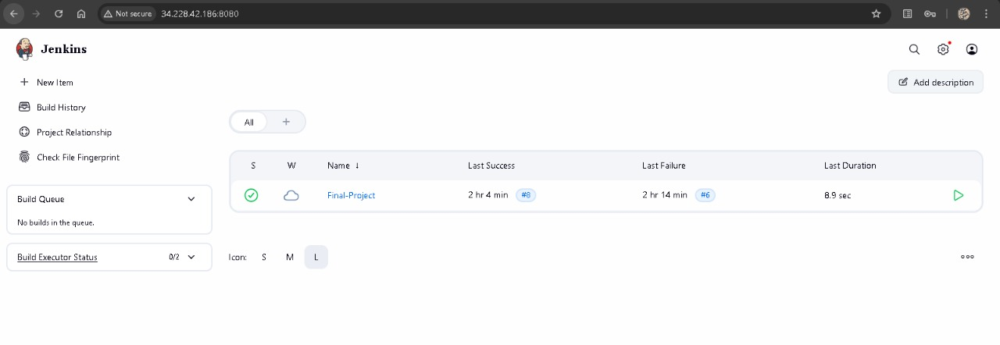
> 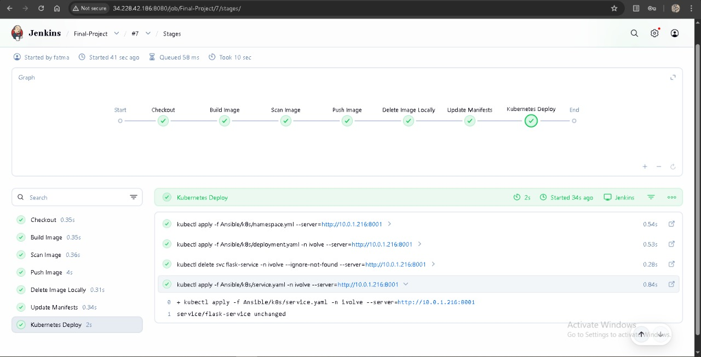
> 

> 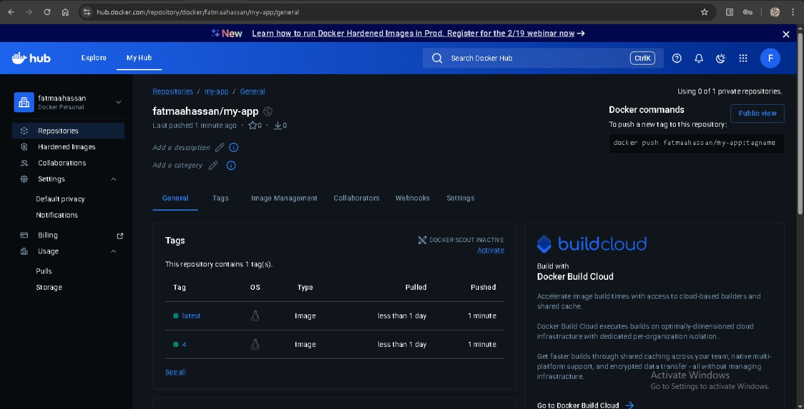

---

## 🐙 Phase 4: Continuous Delivery (ArgoCD & GitOps)
We used **ArgoCD** to implement GitOps. ArgoCD monitors the GitHub repository and ensures the Kubernetes cluster is always in sync with the manifests.
* **Self-Healing:** Automatically fixes any manual changes in the cluster.
* **Automated Sync:** Deploys new versions immediately after Jenkins updates the Git repo.

> **## 📸 Screenshots:**
> 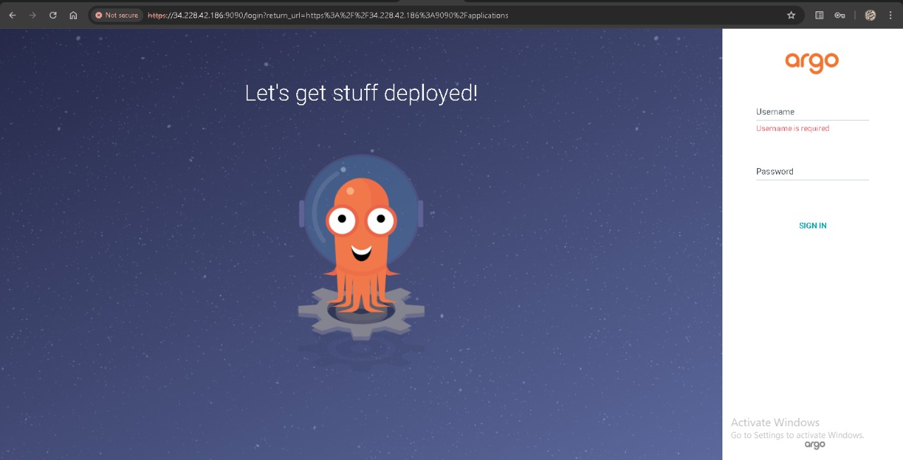
> 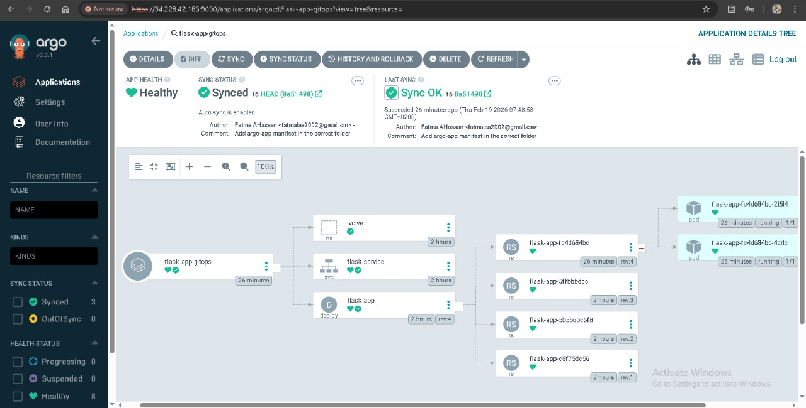
> 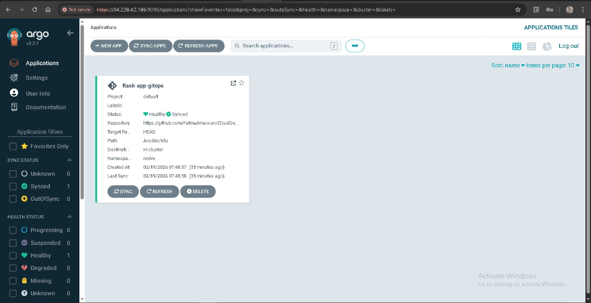

---

## 🌐 Final Application Access
The application is successfully deployed and accessible to the public.

* **ArgoCD Dashboard:** `http://34.228.42.186:9090`

> **Final Result:**
> 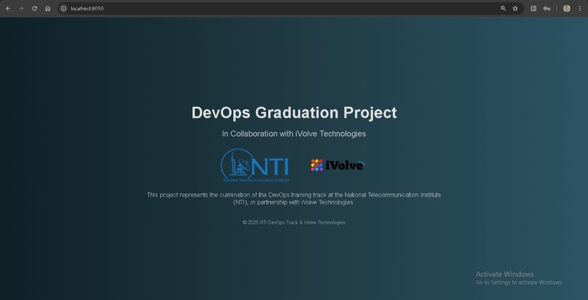

---

## 👨‍💻 How to Use this Repository
1. **Clone:** `git clone https://github.com/FatmaAHassan/CloudDevOpsProject.git`
2. **Infrastructure:** Run `terraform apply` in the Terraform directory.
3. **Configure:** Run the Ansible playbook to setup the environment.
4. **Deploy:** Apply the ArgoCD application manifest: `kubectl apply -f Ansible/argo/argo-app.yaml`.

---
## ✨ Author

Fatma Alaa Hassan